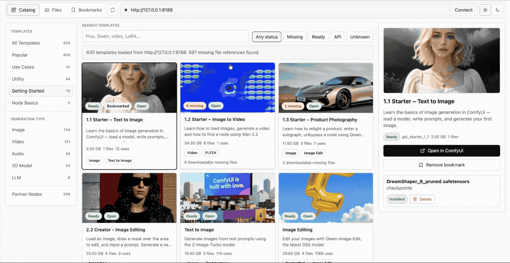
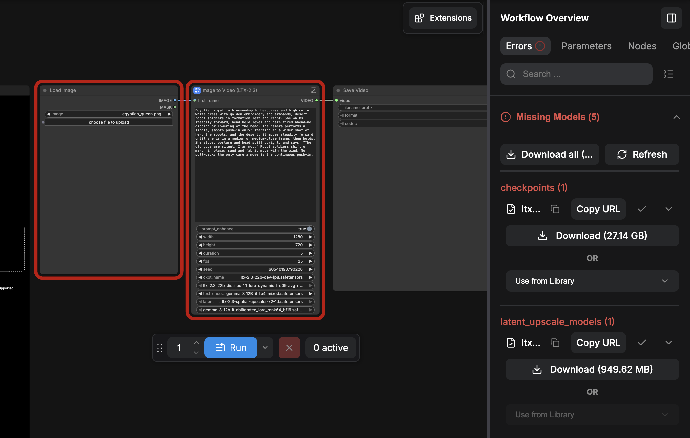
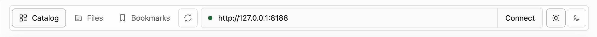
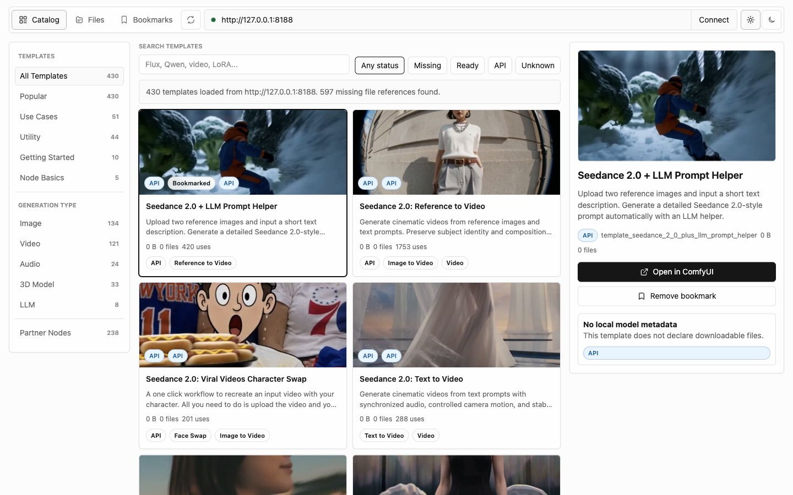
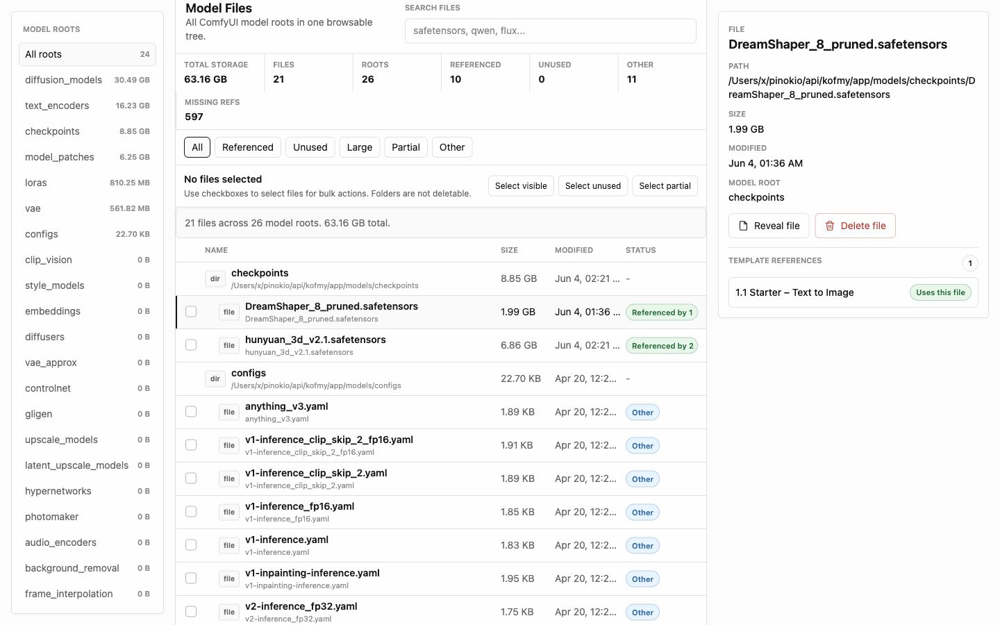
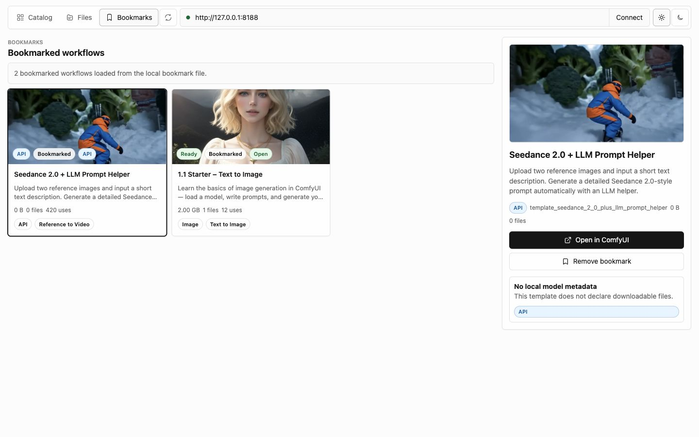

# ComfyFS

ComfyFS is the missing model download and manager for ComfyUI. It automatically discovers your ComfyUI server and:

- helps you find workflows you can run now
- see which model files are missing
- download missing files into the right ComfyUI folders
- and browse, inspect, and delete the model files already on disk.



## Why



If you're a ComfyUI user, you see this everyday. The problem is, when you click "Download", it downloads the model like a regular file and you have to **manually move the files into relevant paths**.


**THIS** is where ComfyFS comes in. It is the missing "missing models" manager for ComfyUI.

1 Click is all you need. ComfyFS automatically downloads all the required model files to correct folders. No more manual management.

## Quick Start

### 1. One Click Install with Pinokio

Just 1-click launch on https://pinokio.co

### 2. Manual Install

If you want to manually install and launch,

```
git clone https://github.com/cocktailpeanut/comfyfs
cd app
npm install
npm start
```

1. Start ComfyUI on the same machine.
2. Install and start ComfyFS.
3. Open the ComfyFS Web UI.
4. Leave the ComfyUI URL as `http://127.0.0.1:8188`, or enter your local ComfyUI URL and click "Connect"

ComfyFS only connects to local loopback ComfyUI URLs. It writes files into local model folders, so remote ComfyUI servers are intentionally blocked.

## Top Bar




The top bar works like a compact browser toolbar.

- **Catalog**, **Files**, and **Bookmarks** switch between the main views.
- The refresh icon reloads the current view. In Catalog and Files it rescans ComfyUI state. In Bookmarks it reloads saved bookmarks.
- The URL field chooses which local ComfyUI server to inspect.
- **Connect** loads templates and model folders from that ComfyUI server.
- The theme buttons switch light and dark mode.

## Catalog



Catalog is where you browse ComfyUI workflow templates.

- Use the search box for models, workflow names, categories, or keywords such as `Flux`, `Qwen`, `video`, or `LoRA`.
- Use the status filters to narrow the list:
  - **Missing** means the workflow needs local model files you do not have yet.
  - **Ready** means ComfyFS found the required local model files.
  - **API** means the workflow does not expose a normal local-model download path.
  - **Unknown** means the template does not declare enough local model metadata.
- Use the left sidebar to browse template categories.
- Select a card to open the detail panel.
- From the detail panel you can open the workflow in ComfyUI, bookmark it, download missing files, or remove installed files when needed.

The most common workflow is: filter to **Missing**, pick a template, review the required files, then download only the files needed for that workflow.

## Files



Files is the local model inventory.

- The left sidebar lists every ComfyUI model root, such as `checkpoints`, `diffusion_models`, `loras`, and `vae`.
- The summary row shows total storage, file count, roots, referenced files, unused files, and missing references.
- Search filters the visible file list.
- The status filters help separate files that are referenced by templates from files that appear unused or only partially referenced.
- Select a file or folder to inspect its path, size, modified date, root, and template references.
- Use **Reveal file** to open the file in your system file browser.
- Use checkboxes for bulk actions. Folders are not deleted.

This view is useful when your model directory has grown large and you need to understand what is actually being used by templates.

## Bookmarks



Bookmarks is a focused list of workflows you want to return to.

- Bookmark a workflow from the Catalog detail panel.
- Open Bookmarks to see only saved workflows.
- Select a bookmarked workflow to open it in ComfyUI or review its files.
- Remove a bookmark when it is no longer useful.

Bookmarks are stored in `app/data/bookmarks.json`, so they survive browser storage resets and normal Pinokio dependency reinstalls.

## Practical Workflows

### Try A New Template

1. Open **Catalog**.
2. Search for the model or workflow type you want.
3. Filter by **Missing** if you want templates that need downloads, or **Ready** if you want something runnable now.
4. Select a template.
5. Download missing files from the detail panel.
6. Click **Open in ComfyUI**.

### Find Where Storage Is Going

1. Open **Files**.
2. Check **Total storage** and the largest model roots in the left sidebar.
3. Select a root such as `diffusion_models` or `checkpoints`.
4. Scan the Size column and inspect large files in the detail panel.
5. Reveal files before deleting anything.

### Keep Favorite Workflows Handy

1. Open **Catalog**.
2. Select a workflow you use often.
3. Bookmark it from the detail panel.
4. Use **Bookmarks** as your short list.

## Safety Notes

- ComfyFS only accepts local ComfyUI URLs.
- Downloads go into the model folders reported by ComfyUI.
- File delete actions remove files from disk. Review the path before deleting.
- Folder rows can be opened or selected for bulk file actions, but folders themselves are not deleted.
- If ComfyUI changes, use the refresh icon to rescan the current view.

## Local API

Most users only need the UI. The local API is available for small scripts and automation.

### JavaScript

```javascript
const app = "http://127.0.0.1:42188"
const comfy = "http://127.0.0.1:8188"

const catalog = await fetch(`${app}/api/templates?baseUrl=${encodeURIComponent(comfy)}`).then((r) => r.json())
const files = await fetch(`${app}/api/files?baseUrl=${encodeURIComponent(comfy)}`).then((r) => r.json())
const bookmarks = await fetch(`${app}/api/bookmarks`).then((r) => r.json())

const missing = catalog.templates.find((template) => template.status === "missing")
const models = missing.models.filter((model) => !model.installed && model.downloadable)

await fetch(`${app}/api/download`, {
  method: "POST",
  headers: { "content-type": "application/json" },
  body: JSON.stringify({ baseUrl: comfy, models })
})
```

### Python

```python
import requests

app = "http://127.0.0.1:42188"
comfy = "http://127.0.0.1:8188"

catalog = requests.get(f"{app}/api/templates", params={"baseUrl": comfy}).json()
files = requests.get(f"{app}/api/files", params={"baseUrl": comfy}).json()
bookmarks = requests.get(f"{app}/api/bookmarks").json()

missing = next(template for template in catalog["templates"] if template["status"] == "missing")
models = [model for model in missing["models"] if not model["installed"] and model["downloadable"]]

requests.post(f"{app}/api/download", json={"baseUrl": comfy, "models": models})
```

### Curl

```bash
curl "http://127.0.0.1:42188/api/templates?baseUrl=http%3A%2F%2F127.0.0.1%3A8188"
curl "http://127.0.0.1:42188/api/files?baseUrl=http%3A%2F%2F127.0.0.1%3A8188"
curl "http://127.0.0.1:42188/api/bookmarks"
curl -X POST "http://127.0.0.1:42188/api/download" \
  -H "content-type: application/json" \
  -d '{"baseUrl":"http://127.0.0.1:8188","models":[{"name":"model.safetensors","directory":"checkpoints","url":"https://huggingface.co/example/repo/resolve/main/model.safetensors"}]}'
```
